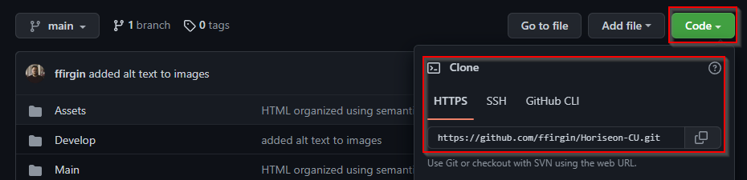

# Horiseon Clean Up

## Description

This project includes code that was cleaned up of non-semantic HTML elements within the index.html file, repetitive class attributes in the style.css file and overall clutter. My motivation was to understand the importance of semantics within an HTML file, and how cluttered and out of hand it could get with many over-lapping divs. Building out this project allows me to understand the gaps within my learning and focus what I'm able to improve on. I learned that having structure between your different files (HTML and CSS in this project) allows the workflow to be more concise and less room for clutter. Understanding that having more does not always make sense.

## Table of Contents

- [Installation](#installation)
- [Usage](#usage)
- [Credits](#credits)
- [License](#license)
- [Tests](#tests)

## Installation

1. On the repository, click Code, and copy the HTTPS link.
   
2. Open your Git Bash terminal.
3. Navigate to where you store your repositories locally on your system
   Ex. ~/Documents/GitHub/, etc
4. Type `git clone ` and paste the HTTPS link from the repository page at the end of the line.
5. Hit Enter and allow the repository to be downloaded.
6. Success! You've downloaded the repository! ♪⁽⁽٩( ᐖ )۶⁾⁾ ₍₍٩( ᐛ )۶₎₎♪

## Usage

You can use this project to view semantic HTML and CSS code.

## License

MIT License

Copyright (c) [year] [fullname]

Permission is hereby granted, free of charge, to any person obtaining a copy
of this software and associated documentation files (the "Software"), to deal
in the Software without restriction, including without limitation the rights
to use, copy, modify, merge, publish, distribute, sublicense, and/or sell
copies of the Software, and to permit persons to whom the Software is
furnished to do so, subject to the following conditions:

The above copyright notice and this permission notice shall be included in all
copies or substantial portions of the Software.

THE SOFTWARE IS PROVIDED "AS IS", WITHOUT WARRANTY OF ANY KIND, EXPRESS OR
IMPLIED, INCLUDING BUT NOT LIMITED TO THE WARRANTIES OF MERCHANTABILITY,
FITNESS FOR A PARTICULAR PURPOSE AND NONINFRINGEMENT. IN NO EVENT SHALL THE
AUTHORS OR COPYRIGHT HOLDERS BE LIABLE FOR ANY CLAIM, DAMAGES OR OTHER
LIABILITY, WHETHER IN AN ACTION OF CONTRACT, TORT OR OTHERWISE, ARISING FROM,
OUT OF OR IN CONNECTION WITH THE SOFTWARE OR THE USE OR OTHER DEALINGS IN THE
SOFTWARE.

## Tests

- Changed the 'seo' part of Horiseon on the header to yellow to be more visible.
- Added an underline to the 'seo' part of Horiseon on the footer to stand out.

GitHub Pages URL: https://ffirgin.github.io/Horiseon-CU/
